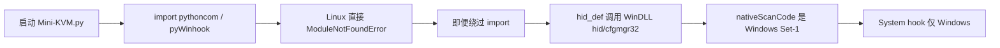

# Linux 适配计划

分支：`linux-port`（从当前 `main` 拉出，含键盘卡顿修复）。
实现放在 Linux 上做，本文件只作说明。

## 结论

**当前 `main` 不支持 Linux。** 导入阶段就会失败，无法当桌面客户端用。

硬件本身没问题：采集卡是标准 UVC，CH58x 是标准 HID，Linux 内核都能认。卡在上位机。

仓库里已有 `cross-platform` 分支（含 Linux 扫描码转换、去掉 pyWinhook、HID 用 VID/PID 打开），但：

- 比现在的 `main` 旧，没有这次键盘卡顿修复
- CI 实际只编 macOS
- 不能直接当现成 Linux 版用

推荐：**把跨平台缺口补到当前 `main` / 本分支**，而不是切回旧分支。

本期只要**绝对鼠标**，不适配相对鼠标。

## 当前 `main` 为什么跑不起来



硬依赖：

| 点 | 位置 | Linux 情况 |
|---|---|---|
| `pythoncom` / `pyWinhook` | `Client/main.py` 顶层 import | 没有这两个包 |
| `pywin32` / `win32_setctime` | `Client/requirements.txt` | 无法安装 |
| `ctypes.WinDLL("hid"/"cfgmgr32")` | `Client/hid_def.py` | 这次为修 Windows 键盘卡顿加的，Linux 无此 DLL |
| `nativeScanCode()` → Set-1 表 | `Client/Data/keyboard_scancode2hid.yml` | Linux/XKB 是 evdev+8，按键会全错 |
| System hook | `pyWinhook.HookKeyboard` | Linux 先关掉或隐藏菜单 |
| `QApplication` 参数 `windows:darkmode=2` | `main()` | 应仅 Windows |
| 工具菜单 `osk` / `calc` / `devmgmt.msc` | `menu_tools_actions` | 可隐藏或换成 Linux 命令 |
| `compiler.ps1` + Nuitka win 参数 | 打包 | 需要另写 Linux 流程 |

## 已有跨平台分支可借鉴什么

`origin/cross-platform` 已经做了这些，适配时应复用思路，不要整分支合并（会冲掉键盘卡顿修复）：

1. **HID**：Linux 上 hidapi 的 `usage_page` 经常是 0，不能靠 usage 过滤；用 `hid.open(VID, PID)`。
2. **键盘**：`normalize_native_scancode()`，XKB keycode − 8 再映射扩展键（Right Ctrl、方向键、Super 等）。参考 `origin/cross-platform:Client/main.py` 里的 `LINUX_EVDEV_TO_SET1`。
3. **依赖**：去掉 pyWinhook / pywin32。
4. **启动参数**：darkmode 只在 Windows 加。

## 适配范围（桌面客户端）

固件不用改。日常用的是 `Client/`。

### 1. 平台分流 HID

`Client/hid_def.py` 按平台分支：

- **Windows**：保持现在的 cfgmgr32 路径枚举（只打开 KVM，避免碰系统键盘）。
- **Linux**：不要 `hid.enumerate()` 扫全机；`hid.open(0x413D, 0x2107)`。用户需能访问 `/dev/hidraw*`（udev 或当前用户进 `plugdev`）。

udev 示例（可放到 `Docs/udev/99-kvm-card-mini.rules`）：

```
SUBSYSTEM=="hidraw", ATTRS{idVendor}=="413d", ATTRS{idProduct}=="2107", MODE="0660", TAG+="uaccess", GROUP="plugdev"
```

采集卡（MS2131，常见 VID `345f`）走 V4L2，一般插上就能在 Qt 里看到。

### 2. 条件导入 Windows 专用代码

- `pythoncom` / `pyWinhook` 仅 Windows import。
- Linux 上 System hook 菜单禁用或隐藏；不要装全局钩子。
- `main()` 里 `windows:darkmode=2` / `--style Windows` 仅 Windows。

### 3. 键盘扫描码

在 `keyPressEvent` / `keyReleaseEvent` 里把 Linux 的 `nativeScanCode` 转成现有 Set-1 表。`cross-platform` 分支的 `LINUX_EVDEV_TO_SET1` 可直接搬。

### 4. 视频和绝对鼠标

Qt Multimedia 在 Linux 走 GStreamer + V4L2。需要：

- `gstreamer1.0-plugins-base/good/bad`（MJPEG/JPEG）
- 确认设备出现在 `QMediaDevices.videoInputs()`（名称可能不是 Windows 上的 `Kira Q0.5 Video`）

不改采集管线，只保证能打开 V4L2 节点。绝对鼠标继续按窗口坐标映射到 0x0000–0x7FFF，不适配相对鼠标。

### 5. 运行与打包

- `requirements.txt` 拆成公共依赖 + Windows extra（pyWinhook、pywin32）
- 文档：venv、udev、GStreamer
- 打包可后做（Nuitka 或直接 `python Mini-KVM.py`）

## 不做的

- 不把 `cross-platform` 整分支合进本分支（会丢掉键盘卡顿修复，资源目录也整棵搬迁）
- 不重写固件
- 第一期不做 Linux 全局键钩（Win/Alt 屏蔽）；窗口焦点内按键即可用
- 不适配相对鼠标

## 建议实施顺序

1. HID 平台分支 + udev 说明，Linux 上能打开 KVM 键鼠
2. 条件导入，程序能启动
3. Linux 扫描码转换，按键能送到被控机
4. 验证 UVC 预览（GStreamer）和绝对鼠标
5. 菜单/主题等平台差异收尾
6. 实机连 Q0.5 / 采集卡跑通

## Linux 上建议的起步命令

```bash
git checkout linux-port
cd Client
python3 -m venv .venv
source .venv/bin/activate
# 先手动去掉/跳过 pyWinhook、pywin32、win32_setctime 再装
pip install -r requirements.txt
```

系统包（Debian/Ubuntu 一类）：

```bash
sudo apt install python3-venv libhidapi-hidraw0 libhidapi-libusb0 \
  gstreamer1.0-plugins-base gstreamer1.0-plugins-good gstreamer1.0-plugins-bad \
  libxcb-cursor0
```
